# 💰 Multi Currency Expense Tracker

An offline-first Android application to track income and expenses across various categories and multiple currencies with intelligent, date specific exchange rates synchronization. Built using Multi-Module Clean Architecture to ensure a clear separation of concerns with Dagger Hilt for dependency injection. Built with Room for local reliability and persistence while integrating Firebase for real-time syncronization across devices. With a modern UI built entirely on Jetpack Compose, the application features dynamic data visualization through charts that turn transactions into financial insights.

## 🌟 Key Features
* **User Authentication**\
  Uses Firebase Authentication to create account using Email & Password Or Google Account, providing secure access to data across multiple devices.
* **Data Synchronization**\
  Offline-first design using Room for instant local data persistence, which automatically syncs with Firebase when connection is available.
* **Intelligent Exchange Rates Sync**\
  Fetches exchange rates based on specific date of transaction, caching them in Room for instant access and syncing them to Firebase to ensure consistent rates across devices and prevent redundant API calls.
* **Visual Financial Insights**\
  Uses Vico chart library to create charts and data visualizations that transform transaction history into easy to understand income and expense trends.
* **Modern Reactive UI**\
  Built entirely with Jetpack Compose, offering fluid and responsive user experience following Material Design 3 standards.
* **Clean Architecture**\
  Structured into :app, :data, and :domain modules to keep the code decoupled, testable, and organized.
* **Dependency Injection**\
  Implements Dagger Hilt to manage dependencies across the multi-module setup.

## 🛠️ Tech Stack
* **Language** : Kotlin
* **Architecture** : Multi-Module Clean Architecture, MVVM
* **UI Framework** : Jetpack Compose
* **Data Visualization** : Vico Charts
* **Local Storage** : Room Database
* **Network & API** : Retrofit, OkHttp, Gson
* **Cloud & Authentication** : Firebase Firestore, Firebase Authentication
* **Dependency Injection** : Dagger Hilt
* **Asynchronous** : Kotlin Coroutines & Flow

## 🏗️ Project Structure
* **:app** : UI layer (Compose Components, Screens, ViewModels, Navigation)
* **:data** : Data layer (Repository Implementation, Room Database, Retrofit, Firebase)
* **:domain** : Domain layer (UseCases, Domain Models, Repository Interface)
  
## 📱 Screenshots
* **Onboarding**
  
  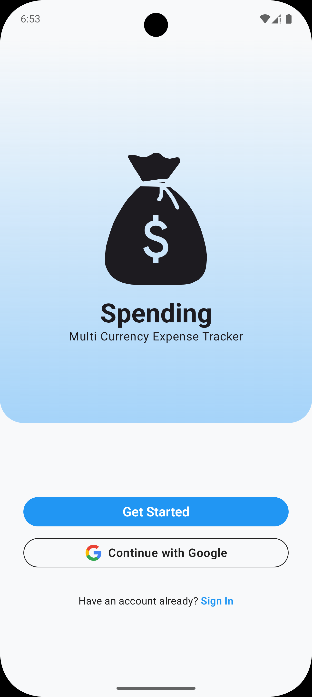  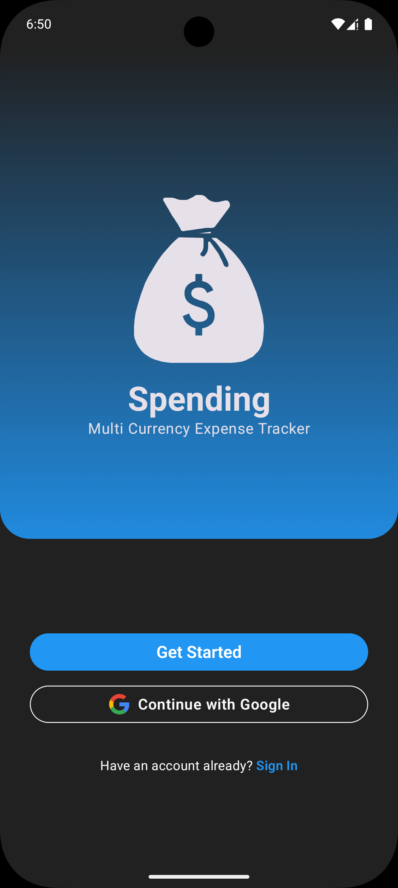
* **Sign Up & Sign In**
  
  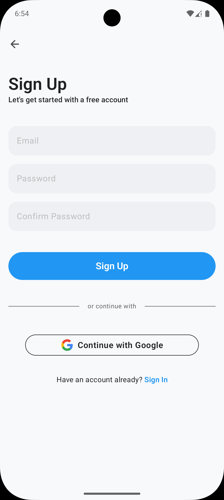  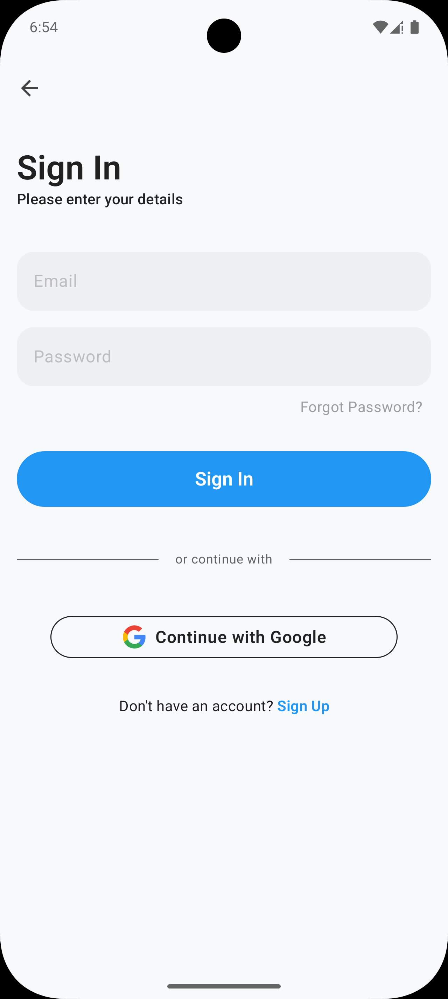\
  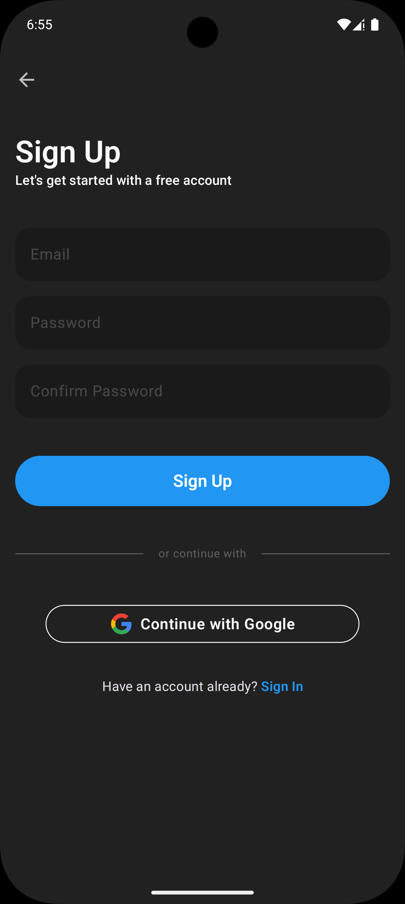  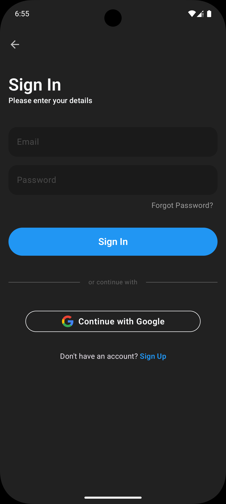
* **Dashboard**

  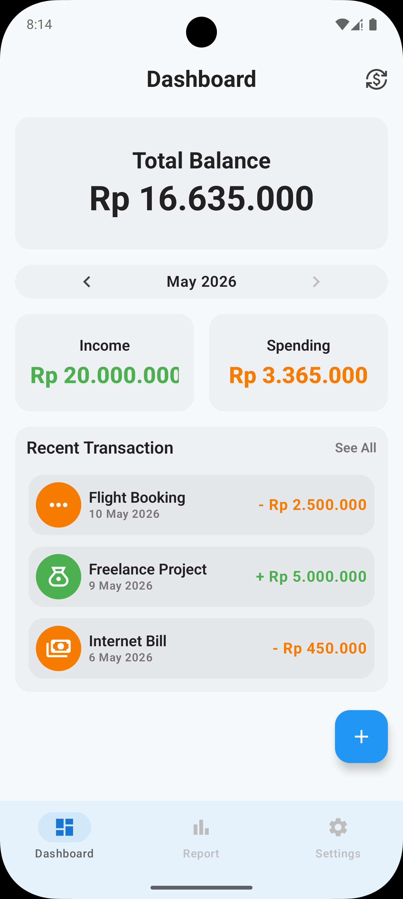  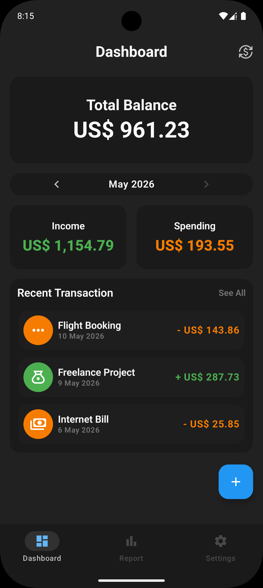
* **Report**

  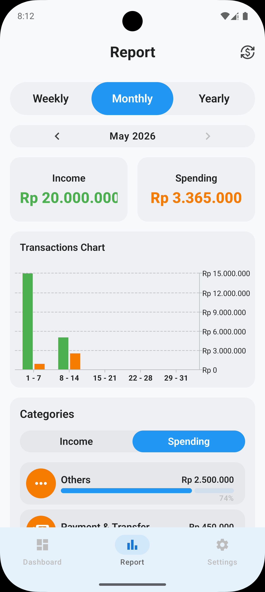  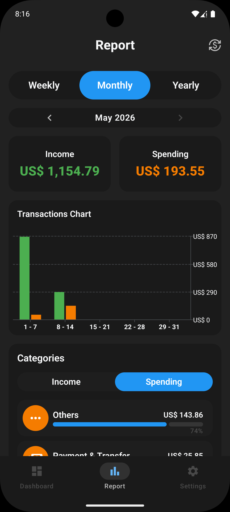
* **New Transaction**

  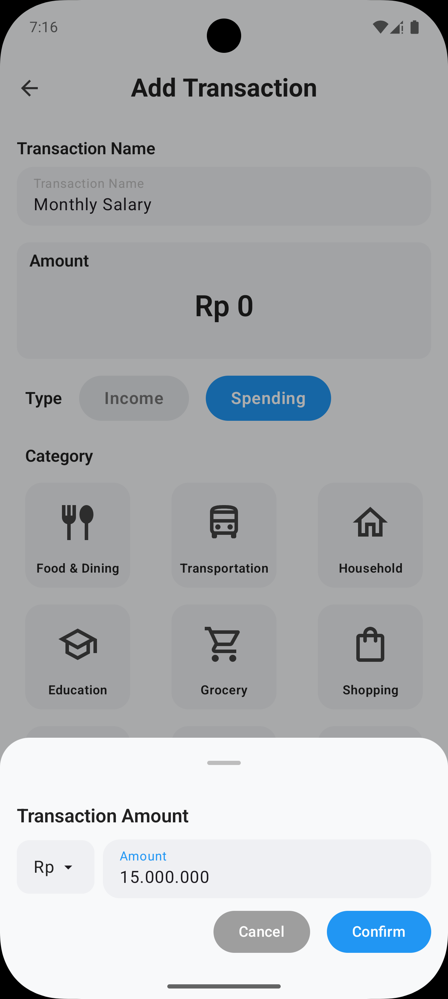  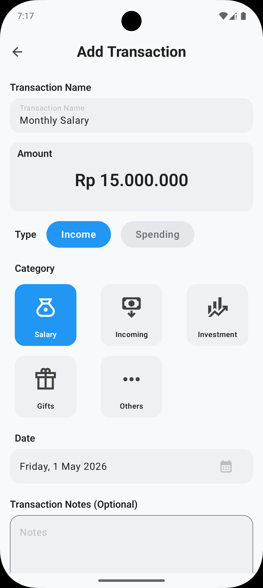\
  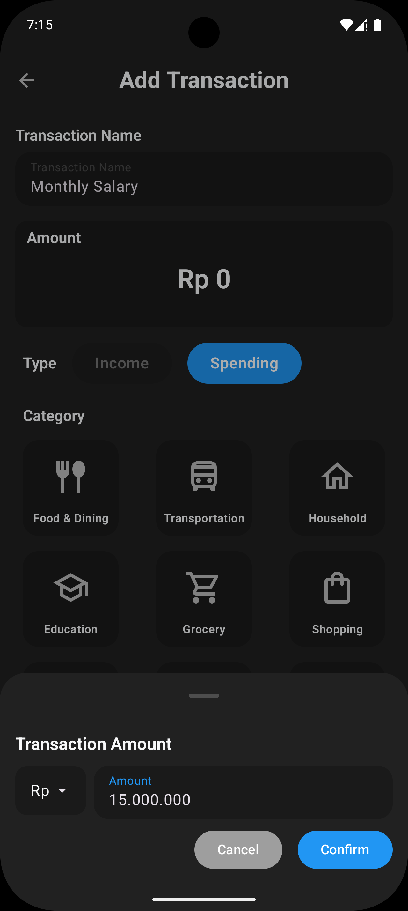  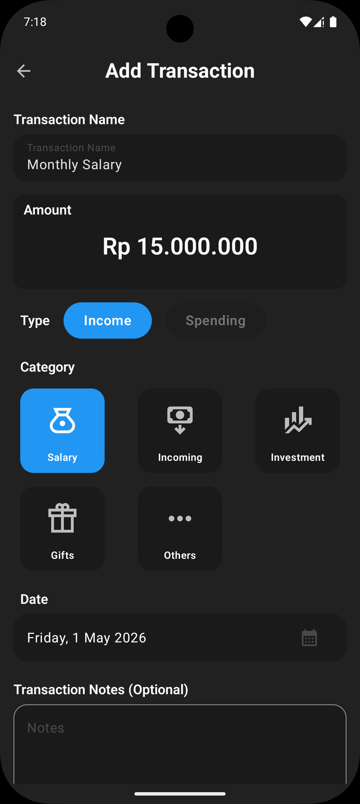
* **Transactions**

  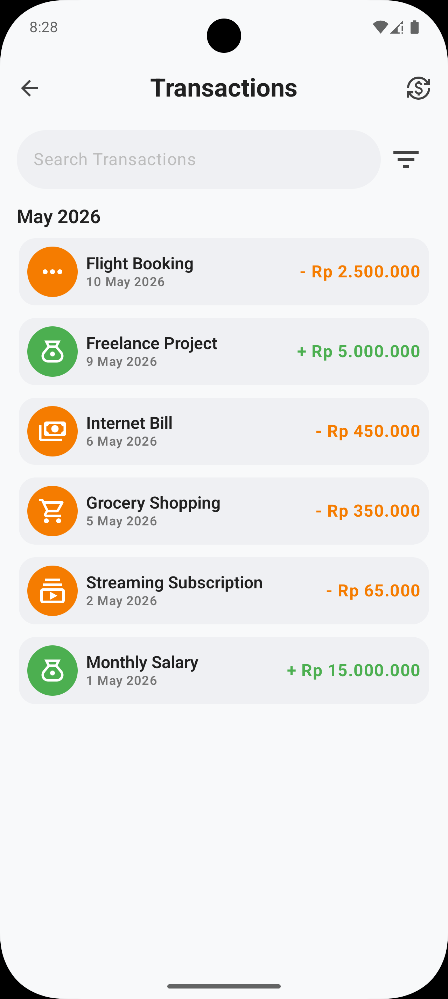  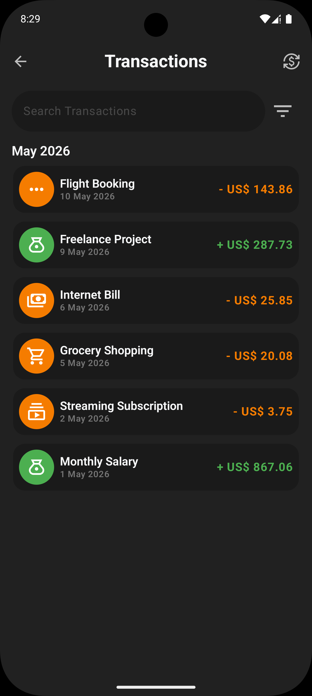
* **Transaction Detail**

  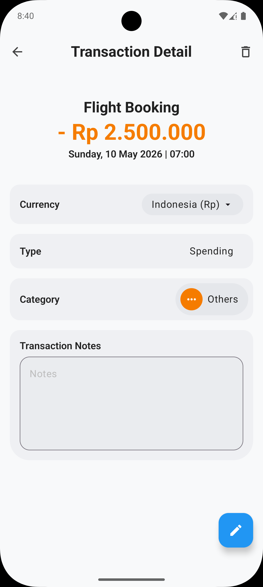  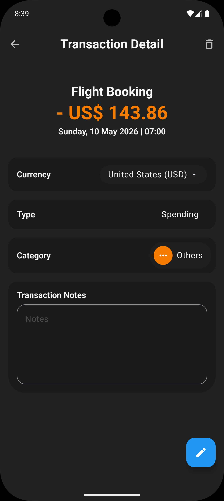
* **Settings**

  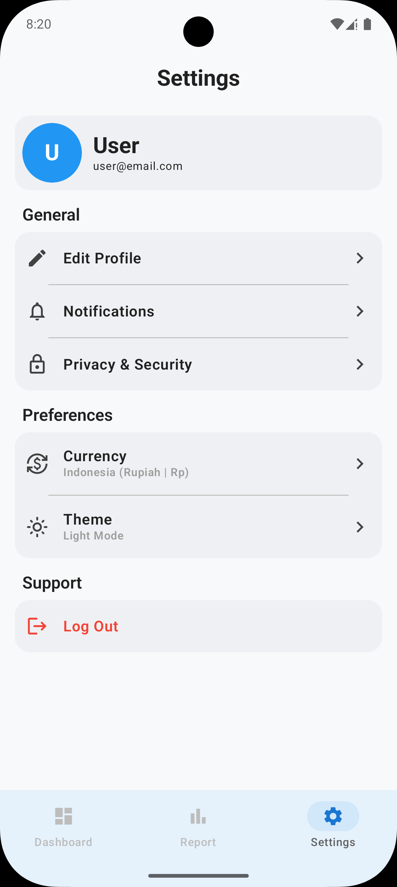  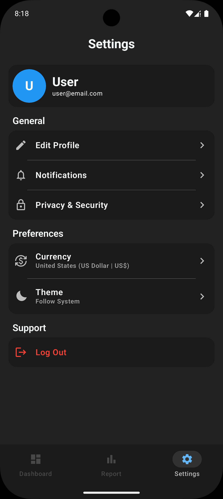
